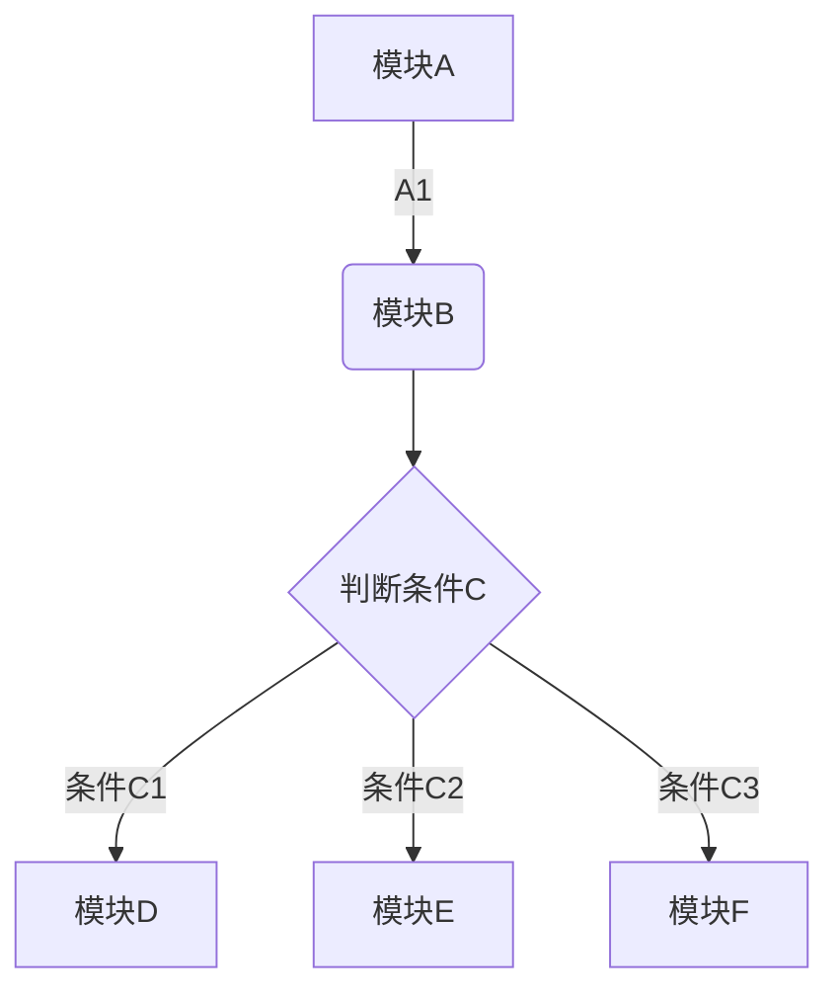
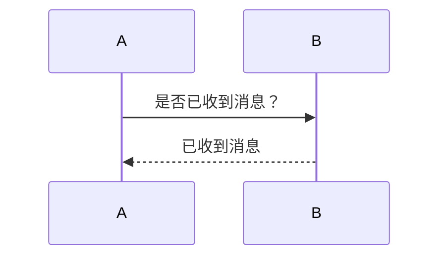
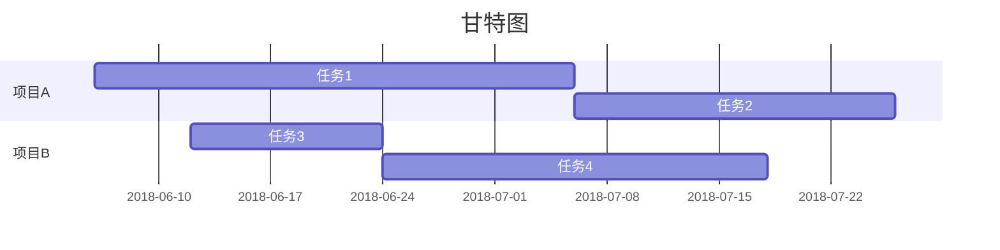
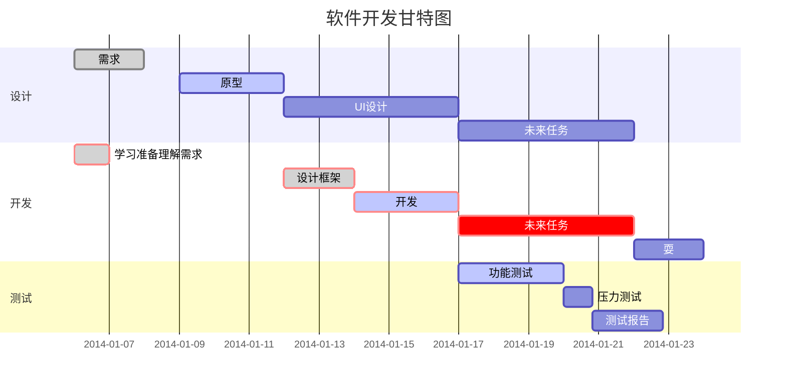

# 我的学习记录11111
## 学习一
[印象网站](https://yinxiang.com/new/hc/articles/%e5%8d%b0%e8%b1%a1%e7%ac%94%e8%ae%b0-markdown-%e5%85%a5%e9%97%a8%e6%8c%87%e5%8d%97/?utm_source=b1&utm_medium=b1&utm_term=sgls4)


<p style="color:red">分割线</p>

<p style="color:red">***</p>

<m style="color:red">***</m>

~~张三李四王武~~

<d style="color:red">~~张三李四王武~~</d>

创建脚注格式类似这样 [^TTT]。

[^TTT]: 菜鸟教程 -- 学的不仅是技术，更是梦想！！！

生成一个脚注1[^3]

[^3]: 这里是 **脚注** 的 *内容*.

生成一个脚注2[^foot]

[^foot]: 这里是**脚注2**的*内容*.

这是一个脚注的例子[^1]

[^1]: 脚注5测试

***
* * *

*****

- - -

----------

| 序号 | 姓名 | 班级 | 年龄 | 爱好 |
| --- | --- | --- | --- | --- |
| 1 | 张三 | 三班 | 3 | 学习 |
| 2 | 张三 | 三班 | 3 | 学习 |

```chart
,Budget,Income,Expenses,Debt
June,5000,8000,4000,6000
July,3000,1000,4000,3000
Aug,5000,7000,6000,3000
Sep,7000,2000,3000,1000
Oct,6000,5000,4000,2000
Nov,4000,3000,5000,

type: pie
title: Monthly Revenue
x.title: Amount
y.title: Month
y.suffix: $
```
``

## 学习二
`教师的行风建设`
```math
e^{i\pi} + 1 = 0
```






## 学习三
```java
public void trset(){
    sout
}
```
```html
<body>
    <div>
        123131231
    </div>
</body>
```